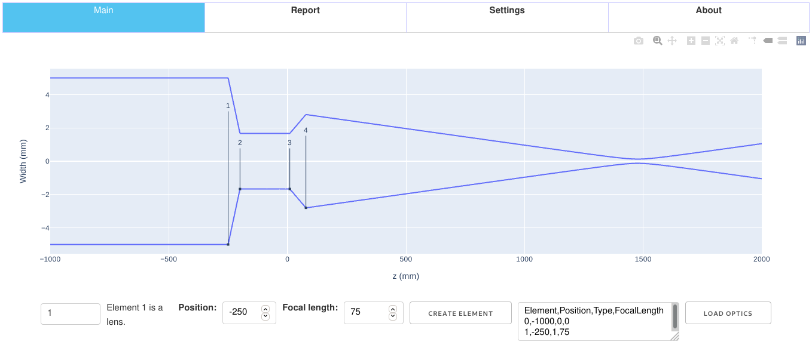

# beampage - Gaussian optics dashboard

A small utility to play with [Gaussian beam optics](https://en.wikipedia.org/wiki/Gaussian_beam) and build systems such as telescopes. Uses Plotly Dash for the presentation.

## Features
### Optics
* Simple "2D" Gaussian beams.
* Available optics: lenses.
* Elements are read from config file and can be moved around the _z_ grid.
* You can change most aspects such as wavelength, waist and plotting axes.
* Switch between convenient single-sided plotting mode and better looking double-sided mode.

### App
* (Simple) layout
* Outputs optics array in csv format to enable saving for later.
* Load said optics array.
* Deploys with gunicorn.
* Ready to be password-protected e.g. for internal use.

## To do

### Optics
* Add other elements such as mirrors.
* Add volume (i.e. not infinitely thin) elements with arbitrary surface curvatures.

### App
* Improve layout... a lot.

### Misc
* Refactor code a bit more - would be nice to really separate the "optics" from the "app".
* Add tests, CI, etc.

## Uses
[Dash](http://dash.plotly.com/),
[Numpy](https://numpy.org/), and
[Pandas](https://pandas.pydata.org/).
